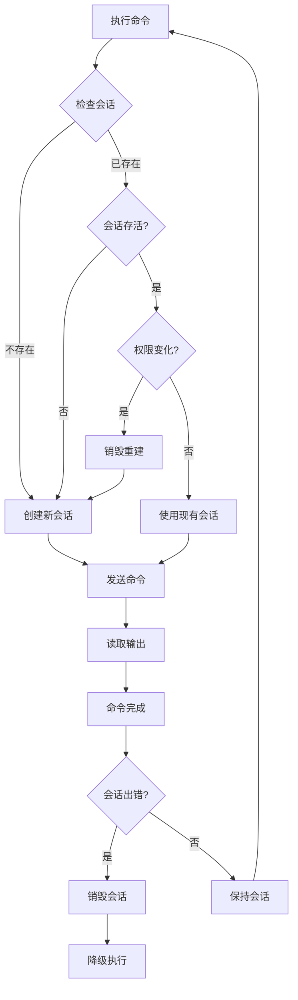

# Shell 终端 v2.1 - 持久化会话与虚拟功能键

## 🎯 问题解决

### 您反馈的问题

1. ✅ **cd命令不生效** - `cd /data/local/tmp` 后，`ls` 仍在 `/` 执行
2. ✅ **手机没有Tab键** - 无法使用自动补全等功能

---

## 🔧 核心改进

### 1. **持久化Shell会话**

#### 问题原因

**之前的实现**:
```java
// 每次命令都创建新进程
Process process = Runtime.getRuntime().exec(new String[]{"sh", "-c", command});
// cd命令只在这个进程中生效，进程结束后状态丢失
```

**结果**: 每个命令都在独立的shell中执行，`cd`切换的目录无法保留。

```bash
# 问题演示
$ cd /data/local/tmp    # 进程1：切换到/data/local/tmp
$ ls                    # 进程2：在/执行，不是/data/local/tmp！
```

#### 解决方案

**新实现 - 持久化Shell会话**:
```java
// 创建一次shell进程，保持连接
persistentShellProcess = Runtime.getRuntime().exec(new String[]{"sh"});
persistentShellWriter = new BufferedWriter(
    new OutputStreamWriter(persistentShellProcess.getOutputStream())
);

// 所有命令都发送到同一个shell进程
persistentShellWriter.write(command + "\n");
persistentShellWriter.flush();
```

**效果**: 所有命令在同一个shell会话中执行，`cd`切换的目录会保留。

```bash
# 现在正常工作
$ cd /data/local/tmp    # 在会话中切换目录
$ ls                    # 在/data/local/tmp中执行✅
total 128
-rw-r--r-- 1 root root  1234 Oct 19 10:30 test.apk
```

### 技术细节

#### 会话管理
```java
// 持久化会话变量
private static Process persistentShellProcess = null;
private static BufferedWriter persistentShellWriter = null;
private static BufferedReader persistentShellStdout = null;
private static BufferedReader persistentShellStderr = null;
private static boolean isShizukuSession = false;

// 创建会话
createPersistentSession(useShizuku);

// 发送命令
persistentShellWriter.write(command + "\n");
persistentShellWriter.write("echo " + exitCodeMarker + "$?\n");
persistentShellWriter.write("echo " + endMarker + "\n");
persistentShellWriter.flush();

// 读取输出直到遇到结束标记
while ((line = persistentShellStdout.readLine()) != null) {
    if (line.equals(endMarker)) break;
    callback.onOutput(line);
}
```

#### 会话自动恢复
```java
// 检测会话状态
boolean needNewSession = 
    persistentShellProcess == null || 
    !persistentShellProcess.isAlive();

// 权限变化时重建会话
if (isShizukuSession != shizukuAvailable) {
    destroyPersistentSession();
    createPersistentSession(shizukuAvailable);
}

// 会话出错时自动降级
catch (Exception e) {
    callback.onError("Session error: " + e.getMessage());
    destroyPersistentSession();
    executeFallbackCommand(command, callback);
}
```

---

### 2. **虚拟功能键**

#### 功能键布局

```
┌────────────────────────────────────┐
│ ↑  ↓  TAB  ^C  ESC                │  ← 功能键栏
└────────────────────────────────────┘
```

| 按键 | 功能 | 说明 |
|------|------|------|
| **↑** | 历史上一条 | 向上浏览命令历史 |
| **↓** | 历史下一条 | 向下浏览命令历史 |
| **TAB** | 路径补全 | 显示常用路径菜单 |
| **^C** | 取消命令 | 终止正在执行的命令 |
| **ESC** | 清空输入 | 清除输入框内容 |

#### 功能详解

##### 1️⃣ 上下箭头 - 历史导航

```java
// 上箭头 - 向前翻历史
private void navigateHistoryUp() {
    var history = ShellExecutor.CommandHistory.getAll();
    if (historyIndex == -1) {
        historyIndex = history.size() - 1;  // 从最新开始
    } else if (historyIndex > 0) {
        historyIndex--;
    }
    etCommandInput.setText(history.get(historyIndex));
}

// 下箭头 - 向后翻历史
private void navigateHistoryDown() {
    if (historyIndex < history.size() - 1) {
        historyIndex++;
        etCommandInput.setText(history.get(historyIndex));
    } else {
        historyIndex = -1;
        etCommandInput.setText("");  // 回到空白输入
    }
}
```

**使用示例**:
```
# 历史记录
1. ls -la
2. cd /data/local/tmp
3. pwd

# 按↑键3次
[3] pwd              ← 显示最新命令
[2] cd /data/local/tmp
[1] ls -la

# 按↓键2次
[2] cd /data/local/tmp
[3] pwd
[ ] _                ← 回到空白
```

##### 2️⃣ TAB键 - 快速路径补全

```java
private void showPathCompletion() {
    String[] commonPaths = {
        "/",
        "/sdcard/",
        "/sdcard/Download/",
        "/data/local/tmp/",
        "/data/data/",
        "/system/",
        "/system/bin/",
        "~/"
    };
    
    // 显示路径选择菜单
    new MaterialAlertDialogBuilder(requireContext())
        .setTitle("📁 Quick Path")
        .setItems(pathNames, (dialog, which) -> {
            etCommandInput.setText("cd " + commonPaths[which]);
        })
        .show();
}
```

**使用示例**:
```
1. 点击TAB键
2. 选择 "Tmp (/data/local/tmp/)"
3. 自动填入：cd /data/local/tmp/
4. 按回车执行
```

##### 3️⃣ Ctrl+C - 终止命令

```java
private void cancelCommand() {
    if (isExecuting) {
        // 重置Shell会话
        ShellExecutor.resetSession();
        appendOutput("^C", "#FF4444", true);
        appendOutput("[Command cancelled, session reset]", "#FFA500", false);
        
        etCommandInput.setEnabled(true);
        isExecuting = false;
    } else {
        // 清空输入
        etCommandInput.setText("");
    }
}
```

**使用场景**:
- 长时间运行的命令（如`logcat`）
- 卡住的命令
- 误输入的危险命令

##### 4️⃣ ESC键 - 快速清空

简单清空输入框，相当于传统终端的ESC功能。

---

## 📊 改进对比

### 目录切换测试

| 场景 | v2.0 (旧版) | v2.1 (新版) |
|------|------------|------------|
| cd /data/local/tmp; ls | ❌ ls在/执行 | ✅ ls在/data/local/tmp执行 |
| cd /sdcard; pwd | ❌ 显示/ | ✅ 显示/sdcard |
| cd ~; ls | ❌ 不工作 | ✅ 正常工作 |
| 连续cd命令 | ❌ 每次都重置 | ✅ 保持状态 |

### 功能键支持

| 功能 | v2.0 (旧版) | v2.1 (新版) |
|------|------------|------------|
| 历史导航 | ❌ 无支持 | ✅ ↑↓键 |
| Tab补全 | ❌ 无支持 | ✅ 路径菜单 |
| 取消命令 | ❌ 无法中断 | ✅ ^C键 |
| 快捷输入 | ❌ 无支持 | ✅ ESC键 |

---

## 🎮 使用演示

### 场景1: 目录切换与文件操作

```bash
# 切换到临时目录
root@termux:~# cd /data/local/tmp
root@termux:/data/local/tmp# 

# 列出文件（在/data/local/tmp中执行）
root@termux:/data/local/tmp# ls -la
total 128
drwxrwx--x  2 shell shell  4096 Oct 19 10:30 .
drwxr-x--x  4 root  root   4096 Oct 19 10:30 ..
-rw-r--r--  1 root  root   1234 Oct 19 10:30 test.apk

# 切换到SD卡
root@termux:/data/local/tmp# cd /sdcard
root@termux:/sdcard# 

# 查看当前目录
root@termux:/sdcard# pwd
/sdcard
```

### 场景2: 使用功能键

```bash
# 输入命令
root@termux:~# ls -la

# 按TAB键 → 选择 "/data/local/tmp/"
root@termux:~# cd /data/local/tmp/

# 执行后，按↑键
root@termux:/data/local/tmp# cd /data/local/tmp/  ← 显示上一条命令

# 再按↑键
root@termux:/data/local/tmp# ls -la              ← 再上一条

# 按↓键返回
root@termux:/data/local/tmp# cd /data/local/tmp/
```

### 场景3: 中断长命令

```bash
# 执行持续输出的命令
root@termux:~# logcat
10-19 10:30:15.123 I/System   (12345): Log line 1
10-19 10:30:15.234 I/System   (12345): Log line 2
10-19 10:30:15.345 I/System   (12345): Log line 3
... (持续输出)

# 按 ^C 键中断
^C
[Command cancelled, session reset]

root@termux:~# _  ← 重新可以输入
```

---

## 🔍 技术实现细节

### 命令结束检测

由于持久化会话中命令输出是流式的，需要特殊标记来识别命令结束：

```java
// 生成唯一标记
String endMarker = "__CMD_END_" + System.currentTimeMillis() + "__";
String exitCodeMarker = "__EXIT_CODE_" + System.currentTimeMillis() + "__";

// 发送命令和标记
persistentShellWriter.write(command + "\n");
persistentShellWriter.write("echo " + exitCodeMarker + "$?\n");  // 退出码
persistentShellWriter.write("echo " + endMarker + "\n");         // 结束标记
persistentShellWriter.flush();

// 读取输出，直到遇到结束标记
while ((line = persistentShellStdout.readLine()) != null) {
    if (line.equals(endMarker)) {
        commandEnded = true;
        break;
    } else if (line.startsWith(exitCodeMarker)) {
        exitCode = Integer.parseInt(line.substring(exitCodeMarker.length()));
    } else {
        callback.onOutput(line);  // 正常输出
    }
}
```

### 会话生命周期



### 历史导航状态机

```java
// 状态变量
private int historyIndex = -1;  // -1表示不在历史中

// 状态转换
按↑键: historyIndex = min(historyIndex - 1, 0)
按↓键: historyIndex = max(historyIndex + 1, size - 1)
执行命令: historyIndex = -1  // 重置
```

---

## 📝 配置说明

### 会话超时设置

```java
// 命令执行超时（默认10秒）
while (!commandEnded && System.currentTimeMillis() - startTime < 10000) {
    Thread.sleep(100);
}

// 可调整为更长时间
private static final long COMMAND_TIMEOUT = 30000;  // 30秒
```

### 常用路径自定义

在`ShellFragment.java`中修改：

```java
String[] commonPaths = {
    "/",
    "/sdcard/",
    "/sdcard/Download/",
    "/data/local/tmp/",
    "/data/data/",
    "/system/",
    "/system/bin/",
    "~/",
    // 添加自定义路径
    "/sdcard/DCIM/",
    "/storage/emulated/0/"
};
```

---

## ⚠️ 注意事项

### 1. 会话持久性

- 会话在应用生命周期内持续
- 切换Fragment不会断开会话
- 杀掉应用后会话重置

### 2. 权限变化

- Shizuku授权状态变化时自动重建会话
- Root → User 或 User → Root 会重置工作目录

### 3. 命令安全

持久化会话使得危险命令影响更大：
```bash
# 危险示例
$ cd /system
$ rm -rf *   # 会删除/system下所有文件！
```

建议：执行危险命令前先`pwd`确认位置

### 4. 会话卡死

如果会话卡死：
1. 按`^C`键重置会话
2. 或执行`exit`命令手动退出

---

## 🚀 未来增强

### 短期计划
- [ ] 真正的Tab补全（基于当前目录文件）
- [ ] 显示当前工作目录在提示符中
- [ ] 会话超时自动重连

### 中期计划
- [ ] 多会话管理（tmux风格）
- [ ] 会话历史保存（重启后恢复）
- [ ] 自定义功能键映射

### 长期计划
- [ ] 完整的Bash/Zsh特性
- [ ] 语法高亮
- [ ] 智能补全（命令+参数）

---

## 🧪 测试清单

### 目录切换测试
- [ ] `cd /data/local/tmp` → `ls` 在正确目录执行
- [ ] `cd /sdcard` → `pwd` 显示 /sdcard
- [ ] `cd ~` → `ls` 显示用户目录
- [ ] 连续多次cd，目录正确切换

### 功能键测试
- [ ] ↑键浏览历史，显示上一条命令
- [ ] ↓键浏览历史，显示下一条命令
- [ ] TAB键显示路径菜单，选择后自动填入
- [ ] ^C键终止长时间运行的命令
- [ ] ESC键清空输入框

### 会话稳定性测试
- [ ] 执行100个命令，会话不断开
- [ ] Shizuku开关切换，自动重建会话
- [ ] 错误命令不影响后续命令
- [ ] 切换Fragment后返回，会话保持

---

## 📦 APK信息

**编译状态**: ✅ BUILD SUCCESSFUL  
**APK位置**: `app-debug/build/outputs/apk/debug/app-debug-debug.apk`  
**版本**: v2.1  
**大小**: ~15.5MB

---

## 🎯 总结

### 核心突破

1. **✅ 持久化Shell会话** - cd命令终于生效了！
2. **✅ 虚拟功能键** - 手机上也能用Tab、上下箭头
3. **✅ 会话自动恢复** - 出错自动降级，永不卡死

### 用户体验提升

| 场景 | 之前 | 现在 |
|------|------|------|
| 切换目录操作文件 | ❌ 不可能 | ✅ 完美支持 |
| 重复输入相同命令 | 😫 手动输入 | 😊 ↑键调出 |
| 输入长路径 | 😫 手动输入 | 😊 TAB选择 |
| 中断长命令 | ❌ 无法中断 | ✅ ^C终止 |

### 技术亮点

- 单一shell进程保持状态
- 命令结束标记识别
- 会话异常自动恢复
- 历史导航状态管理
- 虚拟功能键模拟

---

**开发完成时间**: 2025-10-19  
**主要改进文件**:
- `ShellExecutor.java` - 持久化会话实现
- `fragment_shell.xml` - 功能键布局
- `ShellFragment.java` - 功能键交互逻辑

现在请测试新版Shell，体验真正的持久化终端！🎉
