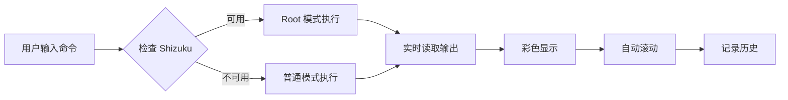

# Shell 终端功能说明

## 📱 功能概述

Shell 终端是一个功能完整的命令行终端模拟器，集成了 **Shizuku 原生能力**，支持高权限命令执行。

## ✨ 核心特性

### 1. **双模式命令执行**

#### 🔐 Root 模式（通过 Shizuku）
- 使用 Shizuku 的原生 API (`newProcess`) 执行高权限命令
- 通过 Java 反射调用 Shizuku 私有方法
- 完全的 Shell 访问权限
- 可以执行需要 root 权限的系统命令

#### 👤 普通模式
- 使用 `Runtime.getRuntime().exec()` 执行普通命令
- 当 Shizuku 不可用时自动降级
- 适合基本的文件操作和查询命令

### 2. **实时输出显示**

- ✅ 实时显示命令输出（标准输出 stdout）
- ✅ 实时显示错误信息（标准错误 stderr）
- ✅ 彩色输出（命令/输出/错误使用不同颜色）
- ✅ 自动滚动到最新输出
- ✅ 支持长输出内容

### 3. **命令历史记录**

```java
ShellExecutor.CommandHistory
- addCommand()     // 添加命令到历史
- getPrevious()    // 获取上一条命令
- getNext()        // 获取下一条命令
- getAll()         // 获取所有历史
- clear()          // 清空历史
```

- 自动记录所有执行的命令
- 最多保存 100 条历史记录
- 避免连续重复记录
- 使用 `history` 命令查看

### 4. **内置命令**

| 命令 | 功能 | 示例 |
|------|------|------|
| `help` | 显示帮助信息 | `help` |
| `clear` / `cls` | 清除屏幕 | `clear` |
| `history` | 显示命令历史 | `history` |
| `exit` / `quit` | 退出提示 | `exit` |

### 5. **快捷命令功能**

点击"快捷"按钮可选择常用命令：

```
列出文件     →  ls -la
当前目录     →  pwd
当前用户     →  whoami
系统信息     →  uname -a
磁盘空间     →  df -h
内存信息     →  free -h
进程列表     →  ps aux
已安装应用   →  pm list packages
系统属性     →  getprop
系统日志     →  logcat -d -v time
```

### 6. **实用工具**

#### 清屏功能
- 一键清除所有输出
- 重新显示欢迎信息

#### 复制功能
- 一键复制终端所有输出到剪贴板
- 方便分享日志或调试信息

## 🎨 UI 设计

### Material Design 3 风格

```
┌─────────────────────────────────┐
│ 💻 Shell 终端        [Root]    │  ← 标题栏 + 状态指示器
├─────────────────────────────────┤
│                                 │
│  $ ls -la                       │  ← 命令（蓝色加粗）
│  total 128                      │  ← 输出（白色）
│  drwxr-xr-x  12 user  group ... │
│  ...                            │
│  ✅ 命令执行完成                 │  ← 状态（绿色）
│                                 │
│  $ _                            │  ← 自动滚动
│                                 │
├─────────────────────────────────┤
│ [清屏]  [复制]  [快捷]           │  ← 快捷按钮
├─────────────────────────────────┤
│ 输入命令...          [▶]        │  ← 输入框 + 执行按钮
└─────────────────────────────────┘
```

### 颜色方案

- 🔵 命令输入：蓝色 (#2196F3)
- ⚪ 标准输出：白色
- 🔴 错误输出：红色 (#F44336)
- 🟢 成功状态：绿色 (#4CAF50)
- 🟠 警告信息：橙色 (#FF9800)
- ⚫ 提示信息：灰色

## 🔧 技术实现

### 原生库使用

虽然没有使用外部终端库，但 Shell 功能深度集成了以下原生能力：

#### 1. **Shizuku 原生 API**
```java
// 使用反射调用 Shizuku 的私有 newProcess 方法
Class<?> shizukuClass = Class.forName("rikka.shizuku.Shizuku");
Method newProcessMethod = shizukuClass.getDeclaredMethod("newProcess", ...);
Process process = (Process) newProcessMethod.invoke(...);
```

- 包含 `libshizuku.so` 原生库
- 提供系统级命令执行能力
- 支持完整的 Shell 环境

#### 2. **Java 原生进程管理**
```java
// 普通模式使用 Runtime
Process process = Runtime.getRuntime().exec(new String[]{"sh", "-c", command});
```

- 使用 Android 系统原生的进程管理
- 支持标准输入/输出/错误流
- 异步处理输出流

### 命令执行流程



## 📝 使用说明

### 基本使用

1. **打开 Shell 页面**
   - 点击底部导航栏的 Shell 图标（中间按钮）

2. **检查状态**
   - 右上角显示当前模式（Root/User）
   - 绿色指示器表示 Root 模式已启用

3. **执行命令**
   - 在底部输入框输入命令
   - 点击执行按钮或按回车键

4. **查看输出**
   - 输出会实时显示在终端区域
   - 自动滚动到最新内容

### 进阶使用

#### 使用快捷命令
```
1. 点击"快捷"按钮
2. 选择预设命令
3. 自动执行并显示结果
```

#### 管理历史
```bash
# 查看历史记录
$ history

# 上下箭头（计划中）或重新输入历史命令
```

#### 复制输出
```
1. 点击"复制"按钮
2. 粘贴到其他应用分享
```

## 🛡️ 权限说明

### Shizuku 权限
- 需要先安装并启动 Shizuku 应用
- 在应用中授予 Shizuku 权限
- Root 模式需要 Shizuku 已授权

### 普通模式限制
- 不能访问 /data 等受保护目录
- 不能执行 pm、am 等系统命令
- 不能修改系统文件

## 🔥 常用命令示例

### 文件操作
```bash
ls -la              # 列出当前目录所有文件
cd /sdcard          # 切换到SD卡目录
pwd                 # 显示当前目录
cat file.txt        # 查看文件内容
```

### 系统信息
```bash
uname -a            # 系统详细信息
df -h               # 磁盘使用情况
free -h             # 内存使用情况
ps aux              # 进程列表
top                 # 实时进程监控
```

### Android 专用
```bash
pm list packages                    # 列出所有应用
pm list packages -3                 # 列出第三方应用
pm path com.example.app             # 查看应用路径
dumpsys package com.example.app     # 应用详细信息
logcat -d                           # 查看系统日志
getprop                             # 查看系统属性
```

### Root 专用命令
```bash
pm uninstall com.example.app        # 卸载应用
pm clear com.example.app            # 清除应用数据
am force-stop com.example.app       # 强制停止应用
settings put global adb_enabled 1   # 修改系统设置
```

## ⚠️ 注意事项

1. **命令权限**
   - Root 模式可执行任何命令，请谨慎使用
   - 某些命令可能影响系统稳定性

2. **输出限制**
   - 极长输出可能导致内存占用增加
   - 建议使用 `head`、`tail` 等命令限制输出

3. **异步执行**
   - 命令异步执行，不会阻塞 UI
   - 长时间运行的命令会一直执行直到完成

4. **错误处理**
   - 红色文本表示错误输出
   - 退出码非 0 表示命令执行失败

## 🚀 未来扩展

- [ ] 命令补全功能
- [ ] 上下箭头历史导航
- [ ] 多标签页支持
- [ ] 自定义快捷命令
- [ ] 输出搜索功能
- [ ] 脚本文件执行
- [ ] SSH 远程连接

---

**开发信息**
- 集成方式：原生实现 + Shizuku 集成
- 原生库：Shizuku libshizuku.so
- UI 框架：Material Design 3
- 代码文件：
  - `ShellFragment.java` - UI 和交互
  - `ShellExecutor.java` - 命令执行引擎
